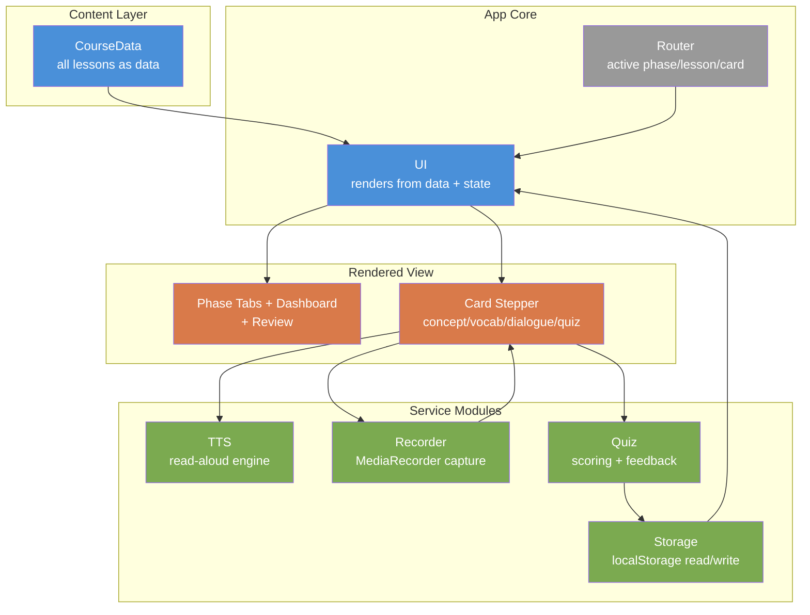

# English Learning SPA — Design Spec

**Date:** 2026-07-01
**Owner:** Sivakumar (Telugu-medium background; targeting professional/pro-level spoken English for a Head-level tech role)
**Status:** Approved design — ready for implementation planning

---

## 1. Purpose & Goals

A single, self-contained learning app to take the user from **basic English grammar gaps** (e.g. uncertainty over shall/should/must/will/would) to **professional, pro-level spoken English** usable in an everyday tech-company Head-level role.

**Primary outcome:** A staged, self-paced course covering grammar → vocabulary → speaking → real-life situations → professional English, with the user's first language (Telugu) available as an on-demand anchor and audio (read-aloud) throughout, plus active speaking practice (shadowing + record/playback).

**Success criteria:**
- The user can learn the exact grammar gaps they named (modals, tenses, articles) with clear rules, examples, targeted mistake-correction, and quizzes.
- Every word/sentence/passage can be heard aloud on demand, at adjustable speed.
- Abstract concepts and new-word meanings can be revealed in Telugu when needed, without forcing Telugu-first reading.
- The user actively practices speaking (shadowing, self-recording) — not just reading.
- Progress persists across sessions and can be backed up.
- Works offline, with zero installation, on desktop and mobile.

---

## 2. Constraints & Non-Goals

**Constraints**
- **Single self-contained `index.html` file.** Inline CSS + JS. No build step, no framework, no external network dependency, no API keys.
- **Fully offline.** Uses only browser-native capabilities (Web Speech API for TTS, `MediaRecorder` for recording, `localStorage` for persistence).
- **Dark-theme-first** (matches user preference), with a light-mode toggle.

**Non-Goals (deliberately excluded — YAGNI)**
- Cloud sync / accounts / servers.
- Gamified streaks / daily-drip enforcement (dashboard stats provide gentle motivation instead).
- Global search, PDF export, per-lesson freeform notes (easy to add later once content grows).
- **Auto pronunciation grading via speech recognition** — deferred (most browsers require internet for it, breaking the offline promise). Self-comparison via record/playback is included instead.

---

## 3. Architecture

One `index.html` file. JavaScript organized into isolated, single-purpose modules (plain namespaced objects), so content and features change independently.



**Module responsibilities**
- **`CourseData`** — all lesson content as a structured data object. Adding a lesson = appending one object; no code changes. This is the file's largest and most-edited section.
- **`Storage`** — get/set progress, settings, and review data in `localStorage` under a single namespaced key; safe defaults if empty.
- **`TTS`** — wraps `speechSynthesis`; picks the best installed English voice; speak / stop; applies the global speed setting.
- **`Recorder`** — wraps `MediaRecorder`; start/stop capture of the user's mic, hold the last recording in memory, play it back. Requests mic permission on first use; degrades gracefully if denied/unsupported.
- **`Quiz`** — validates answers, computes score, produces feedback (incl. optional Telugu "why"), records wrong answers to Review.
- **`Router`** — tracks active tab / lesson / card index; handles keyboard navigation.
- **`UI`** — pure render layer: given data + state, produces the DOM; re-renders on state change.

---

## 4. Data Model

Nested **Phase → Lesson → Card**.

```
Phase   { id, title, icon, lessons[] }
Lesson  { id, title, cards[] }
Card    { type: 'concept'|'vocab'|'example'|'mistake'|'dialogue'|'quiz', ... }
```

**Card shapes**
- **concept** — `{ title, english, telugu?, examples[] }` where each example is `{ text, telugu? }`; examples are read-aloud-able. Telugu reveal on the concept explanation.
- **vocab** — `{ word, pos, meaningEn, meaningTe, examples[] }`; "Still learning / Got it" self-rating feeds Review. Telugu reveal on meaning.
- **example** — `{ pattern?, sentences: [{ text, telugu? }] }`; each read-aloud + shadowing. Grammar-phase examples leave `telugu` empty (immersion); **Situations "key phrases" use this card with `telugu` populated** (Telugu reveal on phrases).
- **mistake** (⚠ Telugu-speaker callout) — `{ wrong, right, whyEn, whyTe? }`; visually distinct warning styling.
- **dialogue** — `{ roles: [A,B], lines: [{ role, text }] }`; color-coded speakers, per-line read-aloud + shadowing, "play whole conversation" button. Dialogue lines are English-only (immersion). Used in Situations.
- **quiz** — `{ questions: [{ format, prompt, options?, answer, explanationEn, explanationTe? }] }` where `format ∈ {mcq, fill, choose-sentence}`.

**Shared UI capabilities attached to text:**
- **Telugu reveal** — appears where a `telugu`/`meaningTe`/`whyTe` field exists (concepts, vocab meanings, scene key phrases, quiz "why").
- **Read-aloud (🔊)** — attaches to any renderable text line.
- **Shadowing / record** — attaches to model lines in examples, phrases, and dialogue turns.

---

## 5. Tabs & Navigation

Top-level tabs: **🏠 Dashboard · 📘 Grammar · 📗 Vocabulary · 🗣 Speaking · 🎬 Situations · 💼 Professional · 🔁 Review**

**Layout**
- **Header:** app title · voice-speed slider (0.5×–1.25×) · theme toggle · Backup/Restore.
- **Phase view:** left panel = lesson list (completion tick + progress bar per lesson); main panel = **card stepper** (one card at a time, Prev/Next, dot position indicator, per-lesson progress).
- **Mobile:** left lesson panel collapses into a dropdown.

**Keyboard:** ← / → = Prev/Next card · Space = toggle Telugu / play audio on focused item.

---

## 6. Feature Details

### 6.1 Telugu support
- Form: **Telugu script**.
- Display: **collapsible reveal** — button `తెలుగులో చూడండి`, hidden by default, toggles open/closed.
- Scope: **concept explanations, vocabulary meanings, Situations key phrases, and quiz "why" notes.** Example sentences and dialogue lines stay English-only for immersion.

### 6.2 Read-aloud (TTS)
- 🔊 button on any word/sentence/passage; ⏹ to stop long passages.
- Global speed slider; auto-selects best installed English voice.
- Hides gracefully if speech synthesis is unavailable.

### 6.3 Speaking practice (offline)
- **Shadowing prompt** — after a model line: "🎙 Your turn — repeat it aloud."
- **Record & self-compare** — `Recorder` captures the user's voice locally; playback sits next to the model TTS for self-comparison. No cloud, no grading.

### 6.4 Quiz engine
- Formats: MCQ, fill-in-the-blank, choose-the-correct-sentence.
- Immediate ✓/✗ feedback + correct answer + explanation (optional Telugu "why").
- Wrong answers recorded to Review; end-of-quiz score.

### 6.5 Progress, Review & storage
- **Storage:** completed cards, lesson completion, quiz scores, per-word "still learning" flags, wrong-answer history, theme, voice speed — all in `localStorage`.
- **Progress:** per-lesson and per-phase bars; lesson "complete" when all cards done + quiz attempted.
- **Review mode:** resurfaces (a) wrong quiz questions and (b) "still learning" words; correct re-answers graduate items out.
- **Backup/restore:** Export all state to a downloadable file; Import restores it.

### 6.6 Dashboard
- "▸ Continue where you left off," overall + per-phase progress, and stats (lessons done, quiz accuracy, words learned). Entry point to Review.

---

## 7. Content Plan

### Phase 1 — Grammar Foundation (authored deep, priority order)
Front-loads the user's stated gaps and classic Telugu-speaker trouble spots. **Author the modals + tenses + articles cluster first**, then work down:

1. Sentence basics — subject–verb–object, word order
2. Articles: a / an / the *(no articles in Telugu → high-impact)*
3. Present simple vs continuous *(fixes "he is having a car")*
4. Past tense (simple & continuous)
5. Future: will / going to / shall
6. Present perfect & past perfect
7. Modals I: can / could, may / might
8. Modals II: shall / will / would  ← named gap
9. Modals III: must / should / have to / ought to  ← named gap
10. Prepositions: in/on/at, to/for
11. Questions & negatives (do/does/did)
12. Subject–verb agreement
13. Conjunctions & linking ideas
14. Adjectives, adverbs & comparatives
15. Conditionals (if-clauses) — intro

Each lesson = concept card(s) → examples → **⚠ common-mistake card** → quiz; with Telugu reveals and read-aloud throughout.

### Seeded phases (real sample lessons, expandable later)
- **📗 Vocabulary** — 2–3 themed sets (everyday essentials, connecting words, workplace basics).
- **🗣 Speaking** — pronunciation basics, natural filler/fluency phrases, "thinking in English" (with shadowing).
- **🎬 Situations** — **4 scenes fully built** (Restaurant, Airport, Workplace, Conference) using dialogue cards; more listed for later (Hotel, Doctor, Bank, Shopping, Phone, Travel/Taxi).
- **💼 Professional** — clear emails, speaking up in meetings, presentation openers, leadership phrasing for a Head-level role.

---

## 8. Testing / Verification

Manual verification in-browser (no framework/test runner needed for a single file):
- Each tab renders; card stepper navigates (buttons + keyboard).
- Telugu reveals toggle correctly where present.
- Read-aloud speaks; speed slider affects rate; stop works.
- Shadowing record → playback works (mic permission, offline); graceful failure if denied.
- Quizzes score, show explanations, record wrong answers.
- Review mode resurfaces wrong answers + "still learning" words; graduation works.
- Progress persists across reload; Export → Import round-trips state.
- Layout works at mobile width.

---

## 9. Open Questions / Future

- Additional Situations scenes and deeper Vocabulary/Speaking/Professional content (iterative).
- Optional online auto-pronunciation check (deferred).
- Possible later additions: search, notes, PDF export.
